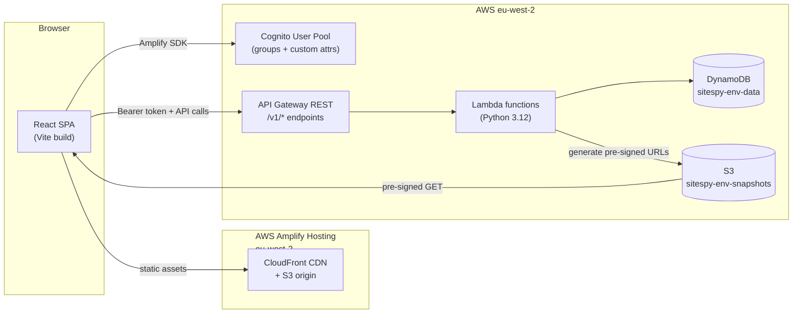
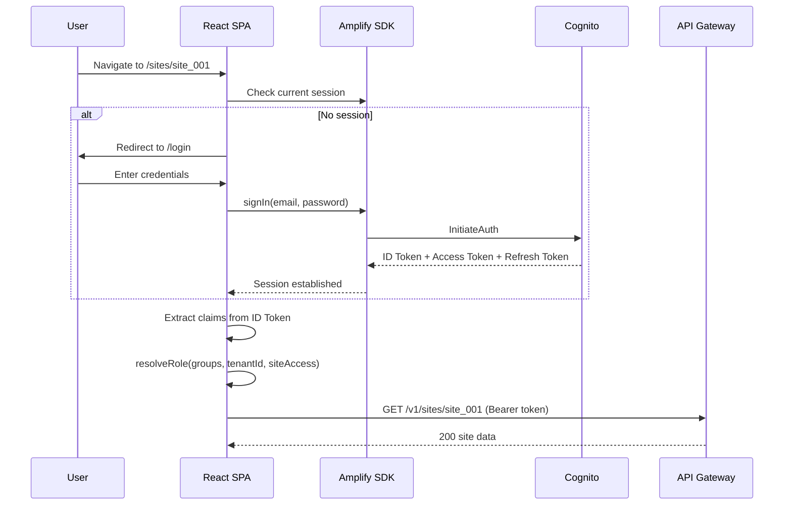

# Design Document — Dashboard (Phase 0 MVP)

## Overview

This design implements the SiteSpy web dashboard: a React 18 + TypeScript single-page application where authenticated users browse camera snapshots, monitor camera health, and raise flags on cameras exhibiting issues. The dashboard consumes the existing API Gateway REST API (same gateway as the ingest endpoint) and displays images exclusively via pre-signed S3 URLs.

**In scope for this milestone:**

- Amplify-based Cognito authentication (login, signup, token management).
- Role-based navigation and route guards (Super Admin, Tenant Admin, User).
- Site view with multi-camera hero (single image or tile grid).
- Heartbeat status indicators (per-camera and aggregate).
- Snapshot gallery with pagination, date filtering, and chronological ordering.
- Lightbox viewer with metadata and keyboard navigation.
- Flag-a-camera flow (raise, duplicate detection, badge display).
- Flag review console for admins (list, filter, sort, action modals).
- Timezone-aware timestamp rendering via shared component.
- Error and empty states (network errors, 403, no cameras, no snapshots, stale images).
- WCAG 2.2 AA accessibility compliance.

**Out of scope:**

- Timelapse generator (future feature — UI placeholders only).
- Admin management UIs (user, tenant, site/camera CRUD) — separate spec.
- Dark mode (tokens are CSS variables for future retrofit).
- Offline/PWA support.
- Real-time WebSocket updates (polling only in MVP).

**Tech stack:** React 18, TypeScript, Vite, Tailwind CSS, shadcn/ui (restyled), AWS Amplify (auth), Axios, Lucide React icons, `@fontsource-variable/inter`, hosted on AWS Amplify Hosting in `eu-west-2`.

---

## Architecture



### Data Flow

1. User loads the SPA from Amplify Hosting (CloudFront → S3 origin).
2. Amplify SDK handles Cognito login; ID token is stored in-memory by Amplify (not localStorage).
3. Every API call attaches `Authorization: Bearer <id_token>` and a generated `X-Correlation-Id`.
4. Lambda validates the JWT, enforces tenant/site access, and returns data with pre-signed S3 URLs (5-minute TTL).
5. The browser fetches images directly from S3 using the pre-signed URLs. No CORS issues — the S3 bucket already allows GET from `*`.

### Hosting

- **Build:** Vite produces a static bundle (`dist/`).
- **Deploy:** Amplify Hosting connects to the Git repo, runs `npm run build`, deploys to CloudFront.
- **Routing:** SPA fallback — all paths serve `index.html`; React Router handles client-side routing.
- **Environment:** `VITE_USER_POOL_ID`, `VITE_CLIENT_ID`, `VITE_API_ENDPOINT` injected at build time.

---

## Components and Interfaces

### Project Structure

```
src/
├── main.tsx                    # App entry, Amplify config, React root
├── App.tsx                     # Router setup, auth guard wrapper
├── api/
│   ├── client.ts              # Axios instance with auth interceptor
│   ├── sites.ts               # GET /sites/{id}
│   ├── snapshots.ts           # GET /snapshots, GET /snapshots/latest
│   └── flags.ts               # POST /flags, GET /flags, PATCH /flags/{id}
├── auth/
│   ├── AuthProvider.tsx       # Amplify auth context + role resolution
│   ├── AuthGuard.tsx          # Route protection (redirect if unauth)
│   ├── RoleGuard.tsx          # Role-based route access
│   └── roles.ts              # resolveRole() pure function
├── components/
│   ├── layout/
│   │   ├── AppShell.tsx       # Sidebar + header + content area
│   │   ├── Sidebar.tsx        # Role-aware navigation
│   │   └── Header.tsx         # Heartbeat indicator, site name, user menu
│   ├── site/
│   │   ├── SiteHero.tsx       # Multi-camera hero (full-width or tile grid)
│   │   ├── CameraTile.tsx     # Single camera tile with heartbeat + flag badge
│   │   └── CameraFocused.tsx  # Single-camera focused view
│   ├── gallery/
│   │   ├── Gallery.tsx        # Paginated thumbnail grid
│   │   ├── ThumbnailCard.tsx  # Single snapshot thumbnail
│   │   ├── DatePicker.tsx     # Day filter
│   │   └── CameraSelector.tsx # Camera dropdown (hidden on single-camera)
│   ├── lightbox/
│   │   ├── Lightbox.tsx       # Full-resolution viewer overlay
│   │   └── LightboxNav.tsx    # Arrow navigation + metadata
│   ├── flags/
│   │   ├── FlagButton.tsx     # "Flag this camera" trigger
│   │   ├── FlagForm.tsx       # Reason + note form modal
│   │   ├── FlagBadge.tsx      # Warning badge on camera tiles
│   │   ├── FlagConsole.tsx    # Admin flag review table
│   │   ├── FlagRow.tsx        # Single flag row with actions
│   │   └── FlagActionModal.tsx # Acknowledge/Resolve/Dismiss modal
│   ├── heartbeat/
│   │   ├── HeartbeatDot.tsx   # Single status indicator (icon + color + label)
│   │   └── HeartbeatSummary.tsx # Aggregate indicator with hover breakdown
│   └── shared/
│       ├── Timestamp.tsx      # Timezone-aware timestamp formatter
│       ├── EmptyState.tsx     # Reusable empty state card
│       ├── ErrorToast.tsx     # Network error toast with retry
│       ├── AccessDenied.tsx   # Full-page 403 state
│       └── ImageWithFallback.tsx # img with placeholder on error + retry
├── hooks/
│   ├── useAuth.ts             # Auth context consumer
│   ├── useSite.ts             # Current site data + cameras
│   ├── useSnapshots.ts        # Paginated snapshot fetching
│   ├── useFlags.ts            # Flag data + mutations
│   └── useHeartbeat.ts        # Heartbeat computation from camera data
├── lib/
│   ├── heartbeat.ts           # Pure: computeStatus(age_seconds), computeAggregate(statuses[])
│   ├── timezone.ts            # Pure: formatTimestamp(utc, timezone, format)
│   └── constants.ts           # Thresholds, reason enum, etc.
├── pages/
│   ├── LoginPage.tsx
│   ├── SitePage.tsx
│   ├── GalleryPage.tsx
│   └── FlagConsolePage.tsx
└── types/
    ├── api.ts                 # API response types
    ├── auth.ts                # Role, AuthState types
    └── site.ts                # Site, Camera, Snapshot, Flag types
```

### Routing

| Path | Page | Access |
| :--- | :--- | :--- |
| `/login` | LoginPage | Public |
| `/` | Redirect to first site or site list | Authenticated |
| `/sites` | Site list (if multiple) | Authenticated |
| `/sites/:siteId` | SitePage (hero view) | Site access |
| `/sites/:siteId/gallery` | GalleryPage | Site access |
| `/sites/:siteId/gallery?camera=:cameraId` | Gallery scoped to camera | Site access |
| `/flags` | FlagConsolePage | Tenant Admin + Super Admin |

### Key Component Responsibilities

**AuthProvider** — Wraps the app. On mount, checks Amplify session. Extracts claims from the ID token, calls `resolveRole()`, and provides `{ user, role, tenantId, siteAccess, isAuthenticated }` via React context.

**AppShell** — Persistent layout: glass-panel sidebar (240px, collapses to 64px icon-rail below 1280px), header with heartbeat indicator and user menu, scrollable content area.

**SiteHero** — Fetches latest snapshots for all cameras. Renders full-width for single camera, tile grid for multiple. Each tile shows the pre-signed image, camera name, heartbeat dot, and flag badge (if applicable).

**Gallery** — Fetches paginated snapshots for one camera. Renders a responsive thumbnail grid (newest first). Supports infinite scroll or "Load more" via `next_cursor`. Date picker filters the `from`/`to` params.

**Lightbox** — Modal overlay. Displays full-resolution image with metadata (timestamp in site timezone, site name, camera name). Arrow key / swipe navigation. Preloads adjacent images.

**FlagConsole** — Admin table with filters (status, reason, site, camera, source) and sort controls. Each row shows flag details + latest snapshot thumbnail. Action buttons open FlagActionModal.

**Timestamp** — Shared component. Accepts `utc` (ISO string) and `timezone` (IANA string). Renders the formatted time using `Intl.DateTimeFormat` with the site's timezone. All timestamp display in the app goes through this component.

---

## Data Models

### TypeScript Types

```typescript
// auth.ts
type Role = 'super_admin' | 'tenant_admin' | 'user';

interface AuthState {
  isAuthenticated: boolean;
  user: CognitoUser | null;
  role: Role;
  tenantId: string | null;
  siteAccess: string[];
}

// site.ts
interface Site {
  site_id: string;
  site_name: string;
  tenant_id: string;
  latitude: number;
  longitude: number;
  timezone: string;
  cameras: Camera[];
}

interface Camera {
  camera_id: string;
  camera_name: string;
  camera_model: string;
}

interface CameraLatest {
  camera_id: string;
  camera_name: string;
  timestamp: string;        // ISO 8601 UTC
  presigned_url: string;
  expires_in: number;
  age_seconds: number;
}

interface Snapshot {
  timestamp: string;
  camera_id: string;
  key: string;
  presigned_url: string;
  expires_in: number;
}

interface SnapshotPage {
  images: Snapshot[];
  next_cursor: string | null;
  total_available: number;
}

// flags.ts
type FlagReason = 'stale_image' | 'physical_damage' | 'obstruction' | 'image_quality' | 'other';
type FlagStatus = 'open' | 'acknowledged' | 'resolved' | 'dismissed';
type FlagSource = 'user' | 'auto';

interface Flag {
  flag_id: string;
  tenant_id: string;
  site_id: string;
  camera_id: string;
  reason: FlagReason;
  note: string | null;
  status: FlagStatus;
  source: FlagSource;
  raised_by: string;
  raised_at: string;
  latest_snapshot: {
    timestamp: string;
    presigned_url: string;
    expires_in: number;
  } | null;
}

interface FlagPage {
  flags: Flag[];
  next_cursor: string | null;
  total_available: number;
}
```

### State Management

The app uses **React Context + hooks** — no external state library. The data is request-scoped (fetched per page) and doesn't require cross-page caching in the MVP.

| Context | Scope | Data |
| :--- | :--- | :--- |
| `AuthContext` | Global | `AuthState` — role, tenant, site access |
| `SiteContext` | Per-site pages | Current site metadata + camera list |

API data (snapshots, flags) is fetched via custom hooks (`useSnapshots`, `useFlags`) that manage loading/error/data states locally. This keeps the architecture simple and avoids premature optimization.

**Why not React Query / TanStack Query?** For the MVP, the data access patterns are straightforward (fetch on mount, paginate forward). Adding a caching layer adds complexity without clear benefit at this scale. If polling or optimistic updates become needed, TanStack Query can be introduced later without architectural changes.

---

## API Endpoints (Existing vs. Needed)

### Already deployed (ingest pipeline)

| Endpoint | Status |
| :--- | :--- |
| `POST /v1/ingest/{token}` | ✅ Live |

### Required for dashboard (to be built)

| Endpoint | Purpose | Priority |
| :--- | :--- | :--- |
| `GET /v1/sites/{site_id}` | Site metadata + camera list | P0 |
| `GET /v1/snapshots/latest` | Latest snapshot per camera (hero view) | P0 |
| `GET /v1/snapshots` | Paginated snapshot list (gallery) | P0 |
| `POST /v1/flags` | Raise a flag | P0 |
| `GET /v1/flags` | List flags (console) | P0 |
| `PATCH /v1/flags/{flag_id}` | Update flag status | P0 |

All dashboard endpoints require a Cognito JWT authorizer on API Gateway. The Lambda functions validate role-based access per `multi-tenant-auth.md` Section 4.

### API Client Configuration

```typescript
// api/client.ts
import axios from 'axios';
import { fetchAuthSession } from 'aws-amplify/auth';
import { v4 as uuidv4 } from 'uuid';

const apiClient = axios.create({
  baseURL: import.meta.env.VITE_API_ENDPOINT,
});

apiClient.interceptors.request.use(async (config) => {
  const session = await fetchAuthSession();
  const token = session.tokens?.idToken?.toString();
  if (token) {
    config.headers.Authorization = `Bearer ${token}`;
  }
  config.headers['X-Correlation-Id'] = uuidv4();
  return config;
});

apiClient.interceptors.response.use(
  (response) => response,
  (error) => {
    if (error.response?.status === 403) {
      // Handled by global error boundary or per-component
    }
    return Promise.reject(error);
  }
);
```

---

## Auth Flow



### Role Resolution (Pure Function)

```typescript
// auth/roles.ts
export function resolveRole(
  groups: string[],
  tenantId: string | null,
  siteAccess: string[]
): Role {
  if (groups.includes('SuperAdmins')) return 'super_admin';
  if (groups.includes('TenantAdmins')) return 'tenant_admin';
  return 'user';
}
```

This function is deliberately simple — it mirrors the backend's resolution logic. The backend is the authoritative source; the frontend uses this only for UI rendering decisions (which nav items to show, which routes to allow).

### Route Protection

```typescript
// auth/AuthGuard.tsx — wraps all authenticated routes
// If !isAuthenticated → redirect to /login
// If role insufficient for route → render AccessDenied

// auth/RoleGuard.tsx — wraps admin-only routes
// If role not in allowedRoles → render AccessDenied
```

---

## Image Loading Strategy

### Pre-signed URL Lifecycle

1. API returns pre-signed URLs with 5-minute TTL (`expires_in: 300`).
2. The browser loads images via standard ``.
3. Once loaded, the image is in the browser's HTTP cache (S3 returns `Cache-Control` headers).
4. If a URL expires before the image loads (slow connection, tab left open), the `onError` handler triggers a re-fetch of the snapshot metadata to get a fresh URL.

### Loading Patterns

- **Hero view:** Load all camera latest images in parallel. Show skeleton placeholders during load.
- **Gallery thumbnails:** Lazy load with `loading="lazy"` on ``. Intersection Observer triggers load as thumbnails scroll into view.
- **Lightbox:** Load full-resolution on open. Preload the next/previous image in the background for smooth navigation.
- **Flag console thumbnails:** Small thumbnails loaded inline — no lazy loading needed (table is paginated).

### ImageWithFallback Component

```typescript
// Handles: loading state (skeleton), error state (placeholder + retry), success state (image)
// On error: shows a neutral placeholder icon with "Image unavailable" text and a "Retry" button
// Retry: re-fetches the snapshot endpoint to get a fresh pre-signed URL
```

### Caching Considerations

- Pre-signed URLs are unique per request (different signature each time), so browser HTTP cache won't help across page navigations.
- For the MVP, this is acceptable. Images are ~200-500KB each, and the gallery loads 50 at a time (thumbnails could be smaller but the API doesn't provide separate thumbnail URLs yet).
- Future optimization: add a thumbnail generation Lambda that produces smaller versions, or use S3 Object Lambda to resize on the fly.

---

## Heartbeat Logic (Pure Functions)

```typescript
// lib/heartbeat.ts

export type HeartbeatStatus = 'healthy' | 'warning' | 'critical';

const THRESHOLDS = {
  WARNING: 5400,   // 90 minutes
  CRITICAL: 10800, // 180 minutes
  OFFLINE: 7200,   // 2 hours — "Camera may be offline" message
} as const;

export function computeCameraStatus(ageSeconds: number): HeartbeatStatus {
  if (ageSeconds > THRESHOLDS.CRITICAL) return 'critical';
  if (ageSeconds > THRESHOLDS.WARNING) return 'warning';
  return 'healthy';
}

export function computeAggregateStatus(ageValues: number[]): HeartbeatStatus {
  if (ageValues.length === 0) return 'healthy';
  const worst = Math.max(...ageValues);
  return computeCameraStatus(worst);
}

export function isCameraOffline(ageSeconds: number): boolean {
  return ageSeconds > THRESHOLDS.OFFLINE;
}
```

These are pure functions, easily testable via property-based tests.

---

## Correctness Properties

*A property is a characteristic or behavior that should hold true across all valid executions of a system — essentially, a formal statement about what the system should do. Properties serve as the bridge between human-readable specifications and machine-verifiable correctness guarantees.*

The dashboard is primarily a UI application, but several pieces of pure logic are excellent candidates for property-based testing: role resolution, heartbeat computation, timestamp formatting, and data ordering. These functions are the "decision layer" that determines what the user sees — getting them wrong means showing the wrong data to the wrong people.

PBT library: **fast-check** (TypeScript, well-maintained, integrates with Vitest).

### Property 1: Role Resolution Determinism

*For any* valid combination of Cognito groups (`[]`, `['SuperAdmins']`, `['TenantAdmins']`), tenant ID (string or null), and site access list (string array), `resolveRole()` SHALL return exactly one of `'super_admin'`, `'tenant_admin'`, or `'user'`, following the priority: SuperAdmins group → super_admin, TenantAdmins group → tenant_admin, otherwise → user.

**Validates: Requirements 1.3**

### Property 2: Auth Guard Completeness

*For any* application route and any unauthenticated state, the AuthGuard SHALL redirect to `/login`. No authenticated-only route is accessible without a valid session.

**Validates: Requirements 1.2**

### Property 3: Site Access Filtering

*For any* user with a `siteAccess` list of N site IDs, the rendered site list SHALL contain exactly those N sites and no others. The set of rendered site IDs equals the set in `siteAccess`.

**Validates: Requirements 2.3**

### Property 4: Camera Heartbeat Status Computation

*For any* non-negative `age_seconds` value, `computeCameraStatus()` SHALL return:
- `'healthy'` when `age_seconds ≤ 5400`
- `'warning'` when `5400 < age_seconds ≤ 10800`
- `'critical'` when `age_seconds > 10800`

The function is total (defined for all non-negative integers) and monotonic (increasing age never improves status).

**Validates: Requirements 3.4, 6.2, 6.3, 6.4**

### Property 5: Aggregate Heartbeat Equals Worst Camera

*For any* non-empty array of `age_seconds` values, `computeAggregateStatus()` SHALL return the same status as `computeCameraStatus(max(ages))`. The aggregate is always the worst individual camera status.

**Validates: Requirements 6.1**

### Property 6: Snapshot Chronological Ordering

*For any* list of snapshots with distinct timestamps, sorting by the gallery's ordering function SHALL produce a strictly descending sequence of timestamps (newest first). No two adjacent items have `timestamp[i] ≤ timestamp[i+1]`.

**Validates: Requirements 4.5**

### Property 7: Timestamp Timezone Formatting

*For any* valid UTC ISO 8601 timestamp and any valid IANA timezone string, the `formatTimestamp()` function SHALL produce a string that represents the same instant in time as the input, expressed in the target timezone. Specifically: parsing the output back to UTC SHALL yield the original timestamp (round-trip within 1-second precision).

**Validates: Requirements 5.2, 10.1**

---

## Error Handling

### Strategy

Errors are handled at three levels:

1. **Global error boundary** — catches unhandled React errors, renders a "Something went wrong" fallback with a reload button. Never a white screen.
2. **API interceptor** — catches 401 (trigger re-auth), 403 (set error state for AccessDenied page), network errors (trigger toast).
3. **Component-level** — each data-fetching hook exposes `{ data, isLoading, error }`. Components render appropriate states.

### Error → UI Mapping

| Error | UI Response | Requirement |
| :--- | :--- | :--- |
| Network failure (no response) | Toast: "Connection lost. Retrying..." + Retry button | 11.1 |
| 401 Unauthorized | Redirect to /login (token expired) | 1.2 |
| 403 Access Denied | Full-page AccessDenied component | 1.6, 11.2 |
| 404 Not Found | "Site not found" or "Camera not found" inline message | — |
| 429 Too Many Requests | Toast: "Too many requests. Please wait." + auto-retry after `Retry-After` | — |
| 500 Internal Error | Toast: "Something went wrong. Please try again." + Retry button | 11.1 |
| Image load failure | Placeholder + "Retry" button (re-fetches pre-signed URL) | 9.3 |
| Empty data (no cameras) | EmptyState card with role-appropriate CTA | 11.3 |
| Empty data (no snapshots) | Neutral empty state with date picker highlighted | 4.9 |
| Stale camera (age > 7200s) | In-view banner with last timestamp + "Raise flag" button | 11.4 |

### Toast System

- Uses shadcn/ui's toast primitive (Radix Toast under the hood).
- Glass-raised styling per design system.
- Auto-dismiss after 4 seconds, explicit close button.
- Stacks vertically in top-right corner.
- Retry toasts persist until dismissed or action taken.

### Retry Logic

- Network errors: automatic retry with exponential backoff (1s, 2s, 4s) up to 3 attempts.
- After 3 failures: show persistent toast with manual Retry button.
- Pre-signed URL expiry: single retry (re-fetch metadata endpoint for fresh URL).
- No retry on 4xx errors (client errors are not transient).

---

## Testing Strategy

### Dual Testing Approach

The dashboard uses both unit/example tests and property-based tests:

- **Property tests** (fast-check + Vitest): verify universal properties of pure logic functions (role resolution, heartbeat computation, timestamp formatting, sort ordering). Minimum 100 iterations per property.
- **Unit/example tests** (Vitest + React Testing Library): verify component rendering, user interactions, API integration, and specific scenarios.
- **Accessibility tests** (axe-core via @axe-core/react + Vitest): automated WCAG checks on rendered components.
- **E2E tests** (Playwright): critical user flows — login, view site, browse gallery, raise flag, admin console.

### Property-Based Tests (fast-check)

Each property test references its design document property and runs 100+ iterations.

| Test File | Property | Tag |
| :--- | :--- | :--- |
| `roles.property.test.ts` | P1: Role resolution | Feature: dashboard, Property 1: Role resolution determinism |
| `auth-guard.property.test.ts` | P2: Auth guard | Feature: dashboard, Property 2: Auth guard completeness |
| `site-access.property.test.ts` | P3: Site filtering | Feature: dashboard, Property 3: Site access filtering |
| `heartbeat.property.test.ts` | P4: Camera status | Feature: dashboard, Property 4: Camera heartbeat status computation |
| `heartbeat.property.test.ts` | P5: Aggregate status | Feature: dashboard, Property 5: Aggregate heartbeat equals worst camera |
| `snapshots.property.test.ts` | P6: Sort ordering | Feature: dashboard, Property 6: Snapshot chronological ordering |
| `timezone.property.test.ts` | P7: Timezone formatting | Feature: dashboard, Property 7: Timestamp timezone formatting |

### Unit/Example Tests

| Area | Key Tests |
| :--- | :--- |
| Auth | Login flow, redirect on unauth, 403 handling, token attachment |
| Navigation | Role-based nav rendering, site picker visibility |
| Site Hero | Single vs multi-camera layout, tile labels, offline message |
| Gallery | Pagination, date filtering, empty state, gap handling |
| Lightbox | Open/close, metadata display, keyboard navigation |
| Flags | Form validation (Other requires note), submit flow, duplicate toast, badge display |
| Flag Console | Filter/sort, action modals, deep link navigation |
| Accessibility | Focus rings, target sizes, aria labels, color-independent status |

### E2E Tests (Playwright)

| Flow | Steps |
| :--- | :--- |
| Login → Site View | Login with credentials → see hero with camera images |
| Gallery Browse | Navigate to gallery → filter by date → paginate → open lightbox |
| Raise Flag | Click flag button → fill form → submit → see confirmation toast |
| Admin Console | Login as admin → view flags → acknowledge a flag → verify status change |
| Keyboard Navigation | Tab through all interactive elements → verify focus visibility |

### Test Configuration

```json
{
  "test": "vitest",
  "coverage": "v8",
  "e2e": "playwright",
  "pbt": "fast-check",
  "pbt_iterations": 100,
  "accessibility": "@axe-core/react"
}
```

### What's NOT Property-Tested

- UI rendering (component output) — use snapshot tests and example-based RTL tests.
- API integration (network calls) — use MSW (Mock Service Worker) for integration tests.
- Accessibility compliance — use axe-core automated checks + manual screen reader testing.
- Navigation/routing — use Playwright E2E tests.

These areas don't have meaningful "for all inputs" properties — they're better served by specific examples and integration tests.
