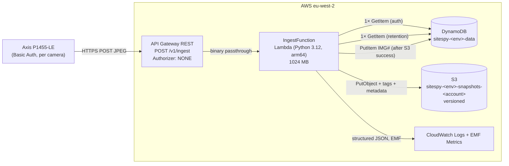
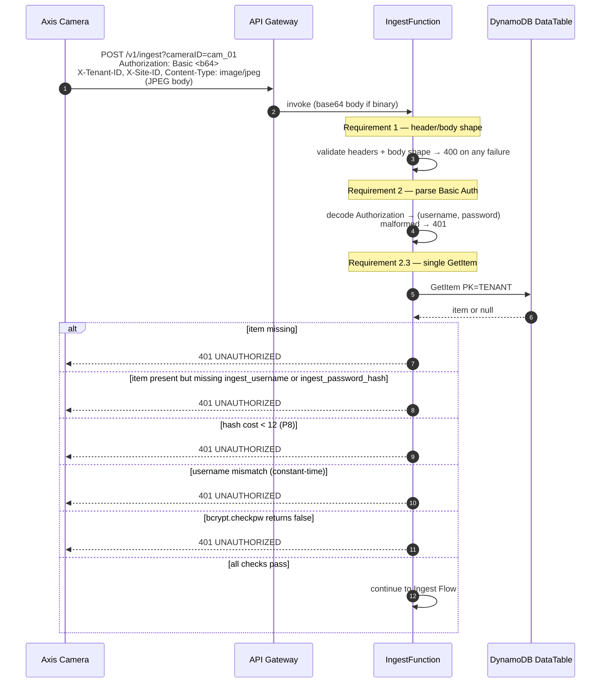

# Design Document — Ingest Pipeline (Phase 0, Milestone 1)

## Overview

This design implements `POST /v1/ingest`: the hourly JPEG-upload path from an Axis camera into S3, with a SHA-256 integrity record in DynamoDB. It realises the 10 requirements in `requirements.md` (plus the 8 correctness properties P1–P8 derived from them).

**In scope for this milestone:**

- The `POST /v1/ingest` Lambda handler end-to-end.
- Per-camera HTTP Basic Auth using credentials collocated on the camera's DynamoDB row (`ingest_username` plaintext, `ingest_password_hash` bcrypt cost ≥ 12). **No Secrets Manager.**
- Single DynamoDB `GetItem` against the camera item for authentication; no second read on the auth path.
- SHA-256 of every JPEG written to S3 object metadata **and** a DynamoDB `IMG#` record.
- Canonical S3 key, retention tagging, idempotent overwrite on duplicate keys.
- Canonical error envelope (`BAD_REQUEST` / `UNAUTHORIZED` / `INTERNAL_ERROR`) — **no 404**.
- One structured log line per request, `IngestSuccess` / `IngestFailure` EMF metrics, correlation IDs.

**Out of scope (explicitly):**

- Cognito, dashboard authorisation, role resolution.
- Flag pipeline and stale-image auto-flag resolver (`IngestSuccess` is the future hook point).
- Admin / CRUD APIs — tenants, users, sites, cameras. Provisioning is by seed script.
- Credential minting flow (bcrypt-hashing at registration) — belongs to `POST /v1/sites/{site_id}/cameras`.
- Dashboard UI, timelapse generator, presigned-URL endpoints.
- CloudWatch alarms, dashboards, paging. This spec emits metrics; routing them is a separate observability milestone.
- Reconciliation of the system-wide docs (`api_contract.md`, `multi-tenant-auth.md`, `software_logic.md`) that still mention Secrets Manager. That follow-up is noted in `requirements.md`.

Regional context: `eu-west-2`, Python 3.12, Lambda ARM64.

---

## Architecture



Auth is inside the Lambda because API Gateway's built-in Basic Auth cannot bind credentials per camera. The path stays at two DynamoDB reads (camera item for auth; tenant item for retention) plus one S3 write plus one DynamoDB write. All reads share a cached `boto3` client.

**Ordering invariant (P5):** S3 write always precedes the `IMG#` DynamoDB write. On S3 failure we skip the `IMG#` write; on `IMG#` failure after S3 success we return 500 and rely on the next successful ingest at the same canonical key to overwrite both.

**Out-of-scope boundary:** the IngestFunction never touches Secrets Manager, never reads Cognito, and never consults any table other than `DataTable`.

---

## Components and Interfaces

All code lives under `src/sitespy/`. Nothing in that tree exists yet — this milestone creates it. Module responsibilities below are definitive.

### `handlers/ingest.py` — request lifecycle

Lambda entry point for `POST /v1/ingest`. Responsibilities:

1. Wrap every invocation in the Powertools decorator stack: `logger.inject_lambda_context(correlation_id_path='headers."X-Correlation-Id"')`, `tracer.capture_lambda_handler`, `metrics.log_metrics(capture_cold_start_metric=True)`.
2. Delegate the body of the request to `_handle(event)`, which raises `ApiError` subclasses on user-visible failure.
3. Catch `ApiError` → emit `IngestFailure` metric + warning log + canonical envelope response.
4. Catch unhandled `Exception` → emit `IngestFailure` metric + exception log + `INTERNAL_ERROR` envelope response (never leak the exception message).
5. On success emit `IngestSuccess` metric + info log and return the 201 envelope.

`_handle(event)` pseudocode:

```python
correlation_id = resolve_correlation_id(event)          # header or fresh UUID v4
tenant_id, site_id, camera_id = validate_identifiers(event)   # BadRequest on regex fail
body = validate_body(event)                             # BadRequest on empty / >10 MiB / bad magic
username, password = parse_basic_auth(event)            # Unauthorized on parse fail
camera_item = data.get_camera(tenant_id, site_id, camera_id)   # single GetItem
camera_auth.verify(username, password, camera_item)     # Unauthorized on any failure mode

snapshot_ts = generate_utc_timestamp()                  # after auth: server-side
sha256_hex = hashlib.sha256(body).hexdigest()
key = storage.build_snapshot_key(tenant_id, site_id, camera_id, snapshot_ts)
retention_years = data.get_retention_years(tenant_id)   # separate GetItem, after auth; default 5

storage.put_snapshot(key, body, sha256_hex, snapshot_ts, tenant_id, retention_years)
data.put_img_record(tenant_id, site_id, camera_id, snapshot_ts, key, sha256_hex, len(body))
return http.json_response(201, {...})
```

Everything in `_handle` is straight-line; no branches other than what's shown.

### `camera_auth.py` — Basic Auth parsing and bcrypt verification (**rewrite**)

This module currently (per `backend-python.md`) caches a Secrets Manager client. **That pattern is gone** in this milestone. The rewritten module:

- Exposes `parse_basic_auth(event) -> tuple[str, str]` — parses the `Authorization` header, base64-decodes, splits on the single `:`, raises `Unauthorized` on any malformation (missing header, non-`Basic` scheme, non-base64, zero or multiple colons).
- Exposes `verify(username: str, password: str, camera_item: Mapping[str, Any]) -> None` — raises `Unauthorized` on every failure mode; returns `None` on success.
- No `boto3` client inside this module — it is pure logic over its inputs. The camera item is fetched by `data.get_camera` and passed in.
- `verify` implementation:
  1. If `ingest_username` or `ingest_password_hash` attribute is missing from `camera_item` → `Unauthorized`.
  2. `hmac.compare_digest(username.encode(), stored_username.encode())` → if false, `Unauthorized`.
  3. Inspect the bcrypt hash cost prefix (`$2b$NN$`). If `NN < BCRYPT_MIN_COST` (12) → `Unauthorized`. Do **not** call `bcrypt.checkpw` (P8).
  4. `bcrypt.checkpw(password.encode(), stored_hash_bytes)` → if false, `Unauthorized`.
- Every `Unauthorized` raise uses the same message ("Authentication failed.") so the wire response is indistinguishable across modes (Requirement 2.10).

**Performance note:** `bcrypt.checkpw` at cost 12 is ~150 ms on Lambda arm64. This is the dominant fixed cost per request. At hourly cadence per camera it is not a correctness issue; it does influence Lambda memory sizing (1024 MB budget in `template.yaml`). A future tenant with sub-minute cadence would need reconsideration.

**What's removed:** Secrets Manager client, the cached `@lru_cache` around it, any `get_secret_value` calls, any IAM policy referencing `secretsmanager:*`.

### `data.py` — DynamoDB helpers

- `build_camera_sk(site_id, camera_id) -> str` → `f"SITE#{site_id}#CAM#{camera_id}"`.
- `build_tenant_pk(tenant_id) -> str` → `f"TENANT#{tenant_id}"`.
- `build_img_sk(site_id, camera_id, snapshot_ts) -> str` → `f"IMG#{site_id}#{camera_id}#{snapshot_ts}"`.
- `get_camera(tenant_id, site_id, camera_id) -> Optional[Mapping[str, Any]]` → single `GetItem` on `DataTable` with those keys; returns `None` if item absent.
- `get_retention_years(tenant_id) -> int` → single `GetItem` on `TENANT#<tenant_id>` / `SK = TENANT#<tenant_id>`; returns the `retention_years` attribute or `RETENTION_YEARS_DEFAULT` (5) if the item or attribute is missing. Logs a warning on default fallback.
- `put_img_record(tenant_id, site_id, camera_id, snapshot_ts, s3_key, sha256_hex, size_bytes) -> None` → unconditional `PutItem` (no `ConditionExpression`) so duplicates overwrite (P3).

All key construction is centralised here. Handlers never build key strings inline. Boto3 client is cached via `@lru_cache` at module level, created with `botocore.config.Config(retries={"mode": "standard", "max_attempts": 3})`.

### `storage.py` — S3 writes and canonical key construction

- `build_snapshot_key(tenant_id, site_id, camera_id, snapshot_ts) -> str` — pure function that produces `<tenant_id>/<site_id>/<camera_id>/<YYYY>/<MM>/<DD>/<snapshot_ts>.jpg`. `<YYYY>/<MM>/<DD>` are parsed out of `snapshot_ts` so there is a single source of date components — the timestamp itself (P2).
- `parse_snapshot_key(key) -> tuple[str, str, str, str]` — inverse. Used only by tests for the round-trip property; kept alongside the builder.
- `put_snapshot(key, body, sha256_hex, snapshot_ts, tenant_id, retention_years) -> None`:
  - `s3.put_object` with:
    - `Body=body`, `ContentType="image/jpeg"`.
    - `Metadata={"sha256": sha256_hex, "ingested-at": snapshot_ts}` → serialised by boto3 as `x-amz-meta-sha256` / `x-amz-meta-ingested-at`.
    - `Tagging=f"tenant_id={tenant_id}&retention_years={retention_years}"`.
  - Retries: **delegate to boto3.** The cached S3 client is constructed with `botocore.config.Config(retries={"mode": "standard", "max_attempts": 3})`, which covers throttling and standard transient 5xx. We do **not** hand-roll a retry loop (simpler, battle-tested). Requirement 5.8 ("up to 2 additional retries with exponential backoff") is satisfied by `max_attempts=3` in standard mode (1 initial + 2 retries, exponential backoff built in).
  - Non-retryable errors (4xx on the PUT, auth failures inside AWS) surface as `ClientError` and are raised to the caller, which maps them to `InternalError`.

### `config.py` — settings loader (**already scaffolded**)

Loads environment variables via `get_settings()` (cached). Fields consumed by this milestone:

| Env var | Field | Purpose |
| :--- | :--- | :--- |
| `SNAPSHOTS_BUCKET` | `snapshots_bucket` | target S3 bucket |
| `DATA_TABLE` | `data_table` | DynamoDB table name |
| `AWS_REGION` | `aws_region` | boto3 client region |
| `ENVIRONMENT` | `environment` | tags and logs |
| `LOG_LEVEL` | `log_level` | Powertools logger level |

`CAMERA_SECRETS_PREFIX` is **removed** from the settings object — no consumer after this milestone.

### `errors.py` — `ApiError` hierarchy (**already scaffolded**)

| Class | Status | Error key |
| :--- | :--- | :--- |
| `BadRequest` | 400 | `BAD_REQUEST` |
| `Unauthorized` | 401 | `UNAUTHORIZED` |
| `InternalError` | 500 | `INTERNAL_ERROR` |

Handlers raise these. `http.error_response` serialises them. No other `ApiError` subclasses are referenced by the ingest path (no `NotFound`, no `Conflict`).

### `http.py` — response helpers (**already scaffolded**)

- `json_response(status, body, correlation_id) -> dict` — always attaches `X-Correlation-Id` response header, `Content-Type: application/json`.
- `error_response(exc: ApiError, correlation_id) -> dict` — shape `{"error": KEY, "message": MSG}`, same headers.
- `unhandled_error_response(correlation_id) -> dict` — wraps `InternalError()` so the wire body is indistinguishable from an explicit `InternalError` raise.

### Summary: new vs changed vs kept

| Module | State |
| :--- | :--- |
| `handlers/ingest.py` | **new** — the entire request orchestrator |
| `camera_auth.py` | **rewrite** — drop Secrets Manager, add bcrypt + cost-guard |
| `data.py` | **new** — key builders, `get_camera`, `get_retention_years`, `put_img_record` |
| `storage.py` | **new** — canonical key builder, `put_snapshot` with boto3 standard retries |
| `config.py` | **change** — remove `CAMERA_SECRETS_PREFIX` field |
| `errors.py` | **kept** — `BadRequest`, `Unauthorized`, `InternalError` are all that's needed |
| `http.py` | **kept** |

---

## Data Models

### Camera item (**modified** for this milestone)

```
PK  = TENANT#<tenant_id>
SK  = SITE#<site_id>#CAM#<camera_id>
```

Two **new** attributes added by this milestone:

- `ingest_username` — plaintext, 32-char random string prefixed `sitespy_cam_`. Minted at camera registration (out of scope). Regex: `^sitespy_cam_[A-Za-z0-9]{20}$`.
- `ingest_password_hash` — bcrypt hash (`$2b$NN$...`) of a 48-char random password, cost `≥ 12`. Binary or UTF-8 string in DynamoDB; the handler normalises to bytes before `bcrypt.checkpw`.

Example item:

```json
{
  "PK": "TENANT#acme_corp",
  "SK": "SITE#site_001#CAM#cam_01",
  "camera_name": "North elevation",
  "camera_model": "Axis P1455-LE",
  "starlink_status": "online",
  "s3_bucket_path": "acme_corp/site_001/cam_01/",
  "ingest_username": "sitespy_cam_8f2a4b9c1d7e5a3f6h2k",
  "ingest_password_hash": "$2b$12$N9qo8uLOickgx2ZMRZoMyeIjZAgcfl7p92ldGxad68LJZdL17lhWy"
}
```

The handler reads `ingest_username` and `ingest_password_hash` during authentication; no other attribute on the item is consulted by the ingest path.

### Tenant item (read-only to this milestone)

```
PK = TENANT#<tenant_id>
SK = TENANT#<tenant_id>
```

Relevant attribute: `retention_years` (integer, 1–10; default 5 when absent).

Example (fragment):

```json
{
  "PK": "TENANT#acme_corp",
  "SK": "TENANT#acme_corp",
  "tenant_name": "Acme Construction Ltd",
  "retention_years": 5,
  "stale_threshold_hours": 24
}
```

### IMG# item (**written by this milestone**)

```
PK = TENANT#<tenant_id>
SK = IMG#<site_id>#<camera_id>#<YYYY-MM-DDTHH:mm:ssZ>
```

Attributes written on every successful ingest:

| Attribute | Value |
| :--- | :--- |
| `s3_key` | canonical S3 key |
| `sha256` | 64-char lowercase hex |
| `size_bytes` | body length (integer) |
| `ingested_at` | `snapshot_ts` (ISO 8601 UTC) |
| `content_type` | `image/jpeg` |

Example:

```json
{
  "PK": "TENANT#acme_corp",
  "SK": "IMG#site_001#cam_01#2025-06-15T14:00:00Z",
  "s3_key": "acme_corp/site_001/cam_01/2025/06/15/2025-06-15T14:00:00Z.jpg",
  "sha256": "e3b0c44298fc1c149afbf4c8996fb92427ae41e4649b934ca495991b7852b855",
  "size_bytes": 512340,
  "ingested_at": "2025-06-15T14:00:00Z",
  "content_type": "image/jpeg"
}
```

### Key builder mapping

| Builder | Inputs | Output |
| :--- | :--- | :--- |
| `build_tenant_pk` | `tenant_id` | `TENANT#<tenant_id>` |
| `build_camera_sk` | `site_id`, `camera_id` | `SITE#<site_id>#CAM#<camera_id>` |
| `build_img_sk` | `site_id`, `camera_id`, `snapshot_ts` | `IMG#<site_id>#<camera_id>#<snapshot_ts>` |
| `build_tenant_sk` | `tenant_id` | `TENANT#<tenant_id>` |
| `storage.build_snapshot_key` | `tenant_id`, `site_id`, `camera_id`, `snapshot_ts` | `<tenant_id>/<site_id>/<camera_id>/<YYYY>/<MM>/<DD>/<snapshot_ts>.jpg` |

---

## Auth Flow



Step-by-step:

1. **Parse** `Authorization: Basic <b64>`. Reject malformed (missing header, wrong scheme, bad base64, wrong colon count) → `401 UNAUTHORIZED`.
2. **Build key** from `X-Tenant-ID` / `X-Site-ID` / `cameraID`. Key = `(TENANT#<t>, SITE#<s>#CAM#<c>)` exactly — this is P4.
3. **GetItem** against `DataTable`. Item missing → `401 UNAUTHORIZED`. This is the "no existence oracle" (Requirement 3.1): we do not return 404 because that would leak the existence of a tenant/site/camera to an unauthenticated probe.
4. **Attribute check.** If either `ingest_username` or `ingest_password_hash` is missing from the item → `401`.
5. **Constant-time username compare** via `hmac.compare_digest`. Mismatch → `401`.
6. **Bcrypt cost guard (P8).** Parse the `$2b$NN$` prefix. If `NN < 12` → `401`. We enforce this before calling `bcrypt.checkpw` so a downgrade-attack stored hash can never produce a success outcome, regardless of the library's behaviour.
7. **`bcrypt.checkpw`.** Returns false → `401`.
8. **Uniform failure surface (Requirement 2.10).** Every `401` returns the same error key (`UNAUTHORIZED`), same message, same envelope. The attacker cannot distinguish "no such camera" from "wrong password" from "cost too low".

**Performance note.** `bcrypt.checkpw` at cost 12 on Lambda arm64 takes ~150 ms. At hourly cadence per camera and even 10,000 cameras this is a rounding error on concurrent executions. Memory size 1024 MB in `template.yaml` already absorbs it. Load consideration, not a correctness one.

**No second read on the auth path.** The only DynamoDB operation between `parse_basic_auth` and the start of the S3 write is the camera `GetItem`. The `retention_years` read happens **after** authentication has succeeded (Requirement 3.2).

---

## Ingest Flow

Continues immediately after `camera_auth.verify` returns without raising.

```mermaid
sequenceDiagram
    autonumber
    participant L as IngestFunction
    participant D as DynamoDB DataTable
    participant S as S3 SnapshotsBucket

    L->>L: snapshot_ts = utc_now() to 1s precision (YYYY-MM-DDTHH:mm:ssZ)
    L->>L: sha256_hex = hashlib.sha256(body).hexdigest()
    L->>L: key = build_snapshot_key(tenant, site, camera, snapshot_ts)

    L->>D: GetItem PK=TENANT#<t> SK=TENANT#<t> (retention)
    D-->>L: item or null
    L->>L: retention_years = item.retention_years or 5 (warn on default)

    L->>S: PutObject key, body, metadata(sha256, ingested-at),<br/>tags(tenant_id, retention_years)<br/>(boto3 standard retries: 1 + 2)
    alt S3 failure after retries
        L-->>L: raise InternalError → 500, skip IMG# write
    else S3 success
        L->>D: PutItem IMG# record (no ConditionExpression)
        alt IMG# write fails
            L-->>L: raise InternalError → 500<br/>(S3 object remains; reconciled on next ingest)
        else IMG# write succeeds
            L-->>L: 201 JSON {key, timestamp, camera_id, sha256}
        end
    end
```

Step-by-step:

1. **Timestamp.** Server-side UTC, 1-second precision (`YYYY-MM-DDTHH:mm:ssZ`). Camera never supplies a timestamp; this removes an entire class of clock-skew and spoofing concerns (Requirement 5.1, resolved ambiguity 1).
2. **Body validation.** Already done earlier; not empty, `≤ 10 MiB`, starts with `FF D8 FF`. Both Content-Type AND magic bytes must pass — defense in depth (Requirement 1.6 + 1.2).
3. **SHA-256.** Over the raw request body — exactly the bytes that S3 will write (Requirement 4.2 / P1).
4. **Canonical key.** `<tenant_id>/<site_id>/<camera_id>/<YYYY>/<MM>/<DD>/<snapshot_ts>.jpg`. Date components parsed out of `snapshot_ts` itself, not taken from a separate clock read — so the key and the record always agree (P2).
5. **Retention read.** Separate `GetItem` on the tenant item; this is **after** auth, **after** hashing, **before** S3. Item missing or `retention_years` absent → default 5 with a `logger.warning`. Don't fail the ingest on this — the ingest is the business-critical path; retention tagging is a nice-to-have that the lifecycle policy will treat as the default anyway.
6. **S3 PutObject.** Single call with:
   - `ContentType: image/jpeg`
   - `Metadata`: `{"sha256": <hex>, "ingested-at": <snapshot_ts>}`
   - `Tagging`: `tenant_id=<tenant>&retention_years=<N>`
   - Retries: `max_attempts=3` (1 initial + 2 retries, exponential backoff) via `botocore.config.Config(retries={"mode": "standard", "max_attempts": 3})`. We document boto3's built-in retry as *the* retry mechanism — no hand-rolled loop.
7. **DynamoDB `IMG#` write (P5 ordering).** Only reached after S3 returns success. Unconditional `PutItem` — so duplicates from the same `(t, s, c, snapshot_ts)` deterministically overwrite (Requirement 7.2 / P3).
8. **On S3 failure:** the `IMG#` write is **skipped**; we return 500. No orphan IMG record, by construction.
9. **On `IMG#` failure after S3 success:** we return 500. The S3 object remains. A subsequent successful ingest at the same canonical key (same tenant/site/camera within the same UTC second) will produce the missing DynamoDB record via the unconditional `PutItem`. This is a self-healing state and does not violate P5 (an `IMG#` record only exists where an S3 object exists; the converse — orphan S3 without `IMG#` — is **allowed and self-reconciling**).
10. **Success response (Requirement 9):**

```json
{
  "key": "acme_corp/site_001/cam_01/2025/06/15/2025-06-15T14:00:00Z.jpg",
  "timestamp": "2025-06-15T14:00:00Z",
  "camera_id": "cam_01",
  "sha256": "e3b0c44298fc1c149afbf4c8996fb92427ae41e4649b934ca495991b7852b855"
}
```

---

## Error Handling

Every non-2xx response returns the canonical envelope and carries `X-Correlation-Id`.

```json
{ "error": "<ERROR_KEY>", "message": "<human_readable>" }
```

### Status / error key matrix

| Status | Error key | Cause | Req. |
| :--- | :--- | :--- | :--- |
| 400 | `BAD_REQUEST` | Missing `Authorization`, `X-Tenant-ID`, `X-Site-ID`, `cameraID`, or `Content-Type: image/jpeg` | 1.2, 1.3 |
| 400 | `BAD_REQUEST` | `X-Tenant-ID` / `X-Site-ID` / `cameraID` fails `^[a-z0-9_]{1,64}$` regex | 1.4 |
| 400 | `BAD_REQUEST` | Request body empty | 1.5 |
| 400 | `BAD_REQUEST` | Body does not start with `FF D8 FF` | 1.6 |
| 400 | `BAD_REQUEST` | Body > 10,485,760 bytes | 1.7 |
| 401 | `UNAUTHORIZED` | Malformed `Authorization: Basic` header (missing, wrong scheme, bad base64, wrong colon count) | 2.2 |
| 401 | `UNAUTHORIZED` | `GetItem` returned no camera item | 2.4 |
| 401 | `UNAUTHORIZED` | Camera item missing `ingest_username` or `ingest_password_hash` | 2.5 |
| 401 | `UNAUTHORIZED` | Username mismatch (constant-time) | 2.8 |
| 401 | `UNAUTHORIZED` | Stored hash cost < 12 (P8) | 2.9 |
| 401 | `UNAUTHORIZED` | `bcrypt.checkpw` returned false | 2.8 |
| 500 | `INTERNAL_ERROR` | S3 PutObject failure after boto3 retries | 5.7 |
| 500 | `INTERNAL_ERROR` | IMG# DynamoDB PutItem failure after S3 success | 6.4 |
| 500 | `INTERNAL_ERROR` | Any unhandled exception | — |

**Not emitted:** 403, 404, 409, 429. The ingest path deliberately has only three status codes. Requirement 3.1 is explicit on no-404. Requirement 8.2 closes the error-key set to exactly `{BAD_REQUEST, UNAUTHORIZED, INTERNAL_ERROR}`.

**Uniform 401 surface (Requirement 2.10):** every 401 cause uses the same `message` string ("Authentication failed.") so an attacker cannot distinguish modes.

**Internal error isolation:** `message` for 500 is always a fixed string ("An internal error occurred."). No stack trace, no exception detail, no AWS error code leaks to the wire. All detail goes to logs under `correlation_id`.

---

## Logging & Metrics

### One structured log line per request

Emitted by the outer wrapper, exactly once per invocation, at INFO on success and WARNING/ERROR on failure. Fields:

| Field | Always | Notes |
| :--- | :--- | :--- |
| `correlation_id` | yes | from `X-Correlation-Id` if valid, else fresh UUID v4 |
| `tenant_id` | best-effort | `unknown` if header missing or invalid |
| `site_id` | best-effort | `unknown` if header missing or invalid |
| `camera_id` | best-effort | `unknown` if query param missing or invalid |
| `route` | yes | literal `POST /v1/ingest` |
| `status_code` | yes | final HTTP status returned |
| `latency_ms` | yes | wall-clock from handler entry to response serialisation |
| `sha256` | on 201 only | Requirement 10.2 |
| `size_bytes` | on 201 only | body length |
| `error` | on non-2xx | the error key |
| `failure_reason` | on non-2xx | short internal tag (e.g. `bcrypt_cost_too_low`, `s3_put_failed`) — safe, does not reveal auth mode to the client |

### EMF metrics (Powertools)

- **`IngestSuccess`** — value `1` on every 201. Dimensions: `tenant_id`, `site_id`, `camera_id`. Namespace `SiteSpy`. This is the hook future stale-image resolution will subscribe to.
- **`IngestFailure`** — value `1` on every non-2xx. Dimensions: `tenant_id`, `site_id`, `camera_id`, `status_code`. Dimension value `unknown` for any ID not extracted.

Cold-start metric via `capture_cold_start_metric=True`.

### Correlation ID handling

- If the incoming `X-Correlation-Id` header matches `^[A-Za-z0-9_-]{1,128}$`, reuse verbatim.
- Otherwise generate a fresh `uuid.uuid4()`.
- Same value is used by: `logger.inject_lambda_context(correlation_id_path=...)`, the EMF metric set, and the `X-Correlation-Id` response header on every response (success and failure).

### Redaction rules (Requirement 10.5 / P7)

The following values MUST NOT appear in any log field, message, or traceback:

- The raw `Authorization` header value (any form).
- The base64-decoded username.
- The base64-decoded password.
- The stored `ingest_password_hash` value read from the camera item.

Implementation: logs never pass the `event` dict or the `camera_item` into a logger call. Specific fields are extracted explicitly. Powertools' `logger.inject_lambda_context` is configured without `log_event=True`. The redaction rule is enforced by code review and by an automated test (`test_secret_redaction.py`, see Testing Strategy) that scans captured `caplog` output after every error-path invocation.

---

## Correctness Properties

*A property is a characteristic or behaviour that should hold true across all valid executions of a system — essentially, a formal statement about what the system should do. Properties serve as the bridge between human-readable specifications and machine-verifiable correctness guarantees.*

The ingest pipeline is a good fit for property-based testing: it is an almost-pure function (request bytes → S3 object + DynamoDB item + HTTP response) with strong invariants. Using `hypothesis` with `moto` and in-memory boto3 mocks keeps per-iteration cost low enough to run each property at 100+ iterations.

The eight properties below were derived from the prework in `requirements.md` and reflected once. They are the consolidated set; every acceptance criterion in `requirements.md` either maps onto one of them, is covered as a dedicated supporting test (header/body validation partition, correlation-ID reuse), or is intentionally a single example (S3 retry instrumentation, constant-time compare via `hmac.compare_digest`).

### Property 1: Integrity — Transitive Hash Equality

*For any* successful ingest of a valid JPEG request body `B`, the four representations of the SHA-256 hash are equal:

```
sha256_hex(B)
  == response_body.sha256
  == IMG_Record.sha256
  == s3_object.metadata["sha256"]
  == sha256_hex(s3_get_object(Canonical_Key).body)
```

Plus on the happy path: `IMG_Record.size_bytes == len(B)`, `IMG_Record.s3_key == Canonical_Key`, `IMG_Record.content_type == "image/jpeg"`, `IMG_Record.ingested_at == response_body.timestamp`, `s3_object.metadata["ingested-at"] == response_body.timestamp`, `s3_object.tags["tenant_id"] == request.tenant_id`, `s3_object.tags["retention_years"] == tenant_row.retention_years or 5`.

**Validates: Requirements 4.1, 4.2, 4.3, 5.3, 5.4, 5.5, 5.6, 6.1, 6.2, 9.1, 9.2, 9.3, 9.4, 9.5**

### Property 2: Canonical Key Bijection

Let `build_key(tenant_id, site_id, camera_id, snapshot_ts)` produce the Canonical_Key and `parse_key(k)` its inverse.

*For any* `(tenant_id, site_id, camera_id)` where each matches `^[a-z0-9_]{1,64}$`, and any `snapshot_ts` matching `^\d{4}-\d{2}-\d{2}T\d{2}:\d{2}:\d{2}Z$`:

```
parse_key(build_key(t, s, c, ts)) == (t, s, c, ts)
```

`build_key` is total and injective. The `<YYYY>/<MM>/<DD>` path segments are derived from `snapshot_ts` itself, not from an independent clock read — so the key and the record always agree on the same calendar instant.

**Validates: Requirement 5.2**

### Property 3: Idempotency

*For any* request `req` that produces Canonical_Key `k` and IMG_Record key `i` on a successful ingest, running the same `_handle` twice in succession with identical bytes and identical Snapshot_Timestamp leaves the system in a state where:

- the Snapshot_Bucket contains exactly one current-version S3 object at `k`,
- the Site_Mapping_Table contains exactly one item at `i`,
- the stored item's attributes and the current object's body match the **second** write.

**Validates: Requirements 7.1, 7.2, 7.3**

### Property 4: Authentication Binding — Structural Invariant

*For any* ingest request `req` with headers `(tenant_id, site_id, camera_id)`, the Ingest_Service performs exactly one DynamoDB `GetItem` during authentication, and the `Key` argument of that call equals:

```
{"PK": "TENANT#" + req.tenant_id,
 "SK": "SITE#"   + req.site_id + "#CAM#" + req.camera_id}
```

No `ingest_username` or `ingest_password_hash` is ever read from any other camera item on the auth path. Cross-camera credential reuse is impossible by construction: a credential physically lives on the row keyed by this triple.

**Validates: Requirements 2.3, 3.2, 3.3**

### Property 5: Ordering — No Orphan IMG Records

*For any* valid execution trace, every `IMG_Record r` observed in the Site_Mapping_Table has a corresponding S3 object (current or non-current version) at `r.s3_key` in the Snapshot_Bucket. Equivalently: no IMG_Record write-success precedes the S3 write-success for the same Canonical_Key.

The converse — an S3 object without an IMG_Record — is permitted and self-heals on the next successful ingest at the same Canonical_Key.

**Validates: Requirements 5.7, 6.3, 6.4**

### Property 6: Error Envelope Closure

*For any* response whose status code is in `[400, 599]`:

- the response body parses as JSON,
- the JSON object contains a non-empty string `error` field,
- `error ∈ {"BAD_REQUEST", "UNAUTHORIZED", "INTERNAL_ERROR"}`,
- `status_code ∈ {400, 401, 500}`,
- the response carries an `X-Correlation-Id` header.

In particular, `status_code == 404` never occurs on `POST /v1/ingest`. Plus: every 401 response shares a byte-identical body across all 401 causes (Requirement 2.10).

**Validates: Requirements 2.10, 3.1, 8.1, 8.2, 8.3**

### Property 7: Secret Redaction

*For any* run of the Ingest_Service that produces log records `L`, no record in `L` contains:

- the raw `Authorization` header value,
- the base64-decoded Basic Auth username,
- the base64-decoded Basic Auth password,
- the `ingest_password_hash` value read from the camera item.

Checked by substring scan across all captured log output after every scenario (happy path and every failure mode).

**Validates: Requirement 10.5**

### Property 8: Bcrypt Cost Confinement

*For any* authentication path that proceeds past the `GetItem` step and returns HTTP 201, the bcrypt cost parameter encoded in the stored `ingest_password_hash` is `≥ 12`. Equivalently: no authentication success is ever produced against a hash with cost `< 12`, even when the submitted password would otherwise verify under `bcrypt.checkpw`.

Testable as a mutation: inserting a cost-10 hash into the mocked camera row and submitting the matching plaintext password MUST return HTTP 401, not 201.

**Validates: Requirement 2.9**

---

## Testing Strategy

**Dual approach:**
- **Unit / property tests** (`pytest -m 'not integration'`) — fast, in-memory, `moto` + `hypothesis`. Run on every PR.
- **Integration tests** (`pytest -m integration`) — LocalStack for S3 retry instrumentation and the cold-start smoke. Run in CI only.

PBT is appropriate here: the handler is almost a pure function over its inputs, the input space is large (headers, bodies, credentials, race conditions), and the invariants are strong (integrity equality, structural binding, ordering).

### Library choices

- `hypothesis` — property-based testing. Minimum 100 iterations per `@given` (enforced via `@settings(max_examples=100)`).
- `moto` (via `@mock_aws`) — in-memory DynamoDB and S3. Fast enough for `max_examples=100` per property.
- `aws-lambda-powertools[testing]` — for capturing EMF metric output.
- `pytest-mock` — for boto3 call-argument capture in structural tests.
- `bcrypt` (runtime) — hashes for fixtures.
- `caplog` (stdlib pytest fixture) — log record capture for P7.

### Test file layout

Mirrors `src/` per `structure.md`.

```
tests/
├── requirements-dev.txt
├── conftest.py                               # env vars, moto setup, factories
└── sitespy/
    ├── test_config.py
    ├── test_camera_auth.py                   # parse_basic_auth; verify unit tests
    ├── test_data.py                          # key builders; get_camera; put_img_record
    ├── test_storage.py                       # P2 round trip; put_snapshot with moto
    ├── test_http.py
    ├── test_errors.py
    └── handlers/
        ├── test_ingest_happy_path.py         # P1 four-way equality property
        ├── test_ingest_idempotency.py        # P3
        ├── test_ingest_auth_binding.py       # P4 (mocked boto3 call capture)
        ├── test_ingest_ordering.py           # P5 (injected DynamoDB failure)
        ├── test_ingest_error_envelope.py     # P6 closure
        ├── test_ingest_redaction.py          # P7
        ├── test_ingest_bcrypt_cost.py        # P8
        ├── test_ingest_validation.py         # Requirements 1.2–1.7 supporting property
        ├── test_ingest_correlation_id.py     # Requirement 10.1
        └── test_ingest_metrics.py            # Requirements 10.3 / 10.4 EMF
```

### Fixtures (in `conftest.py`)

- `aws_env` — sets `SNAPSHOTS_BUCKET`, `DATA_TABLE`, `AWS_REGION=eu-west-2`, `ENVIRONMENT=test`, `LOG_LEVEL=INFO` before `get_settings` is called. Session-scoped.
- `moto_s3` / `moto_dynamodb` — `@mock_aws` fixtures that create the bucket (versioning enabled) and table matching `template.yaml` shape.
- `camera_row_factory(tenant_id, site_id, camera_id, *, username="...", password="...", cost=12, include_hash=True, include_username=True)` — writes a camera item to the mocked DynamoDB with a freshly bcrypt-hashed password at the requested cost. Returns `(username, plaintext_password)` so tests can build `Authorization` headers.
- `tenant_row_factory(tenant_id, *, retention_years=None)` — writes the tenant row; omits the attribute when `retention_years is None`.
- `ingest_event(tenant_id, site_id, camera_id, *, body, username, password, correlation_id=None, content_type="image/jpeg")` — builds an API Gateway REST event dict. Handles base64 encoding of binary bodies.
- `jpeg_body(size=1024)` — returns bytes starting with `FF D8 FF E0` padded to `size`; used as a valid JPEG prefix for property generators.

### Property test mapping

| Property | Test module | Technique |
| :--- | :--- | :--- |
| **P1 Integrity** | `test_ingest_happy_path.py` | `@mock_aws` + `hypothesis` generators for `(tenant_id, site_id, camera_id)` within regex, random JPEG body 3 B – 1 MiB (magic-byte-prefixed). Assert four-way SHA-256 equality across response / IMG# record / S3 metadata / S3 body. Assert `size_bytes`, `s3_key`, `ingested_at`, `content_type`, `tenant_id` tag, `retention_years` tag. 100+ iterations. |
| **P2 Canonical Key Bijection** | `test_storage.py` | Pure-function PBT. `@given` over `(t, s, c, ts)` tuples matching the grammars. Assert `parse(build(t, s, c, ts)) == (t, s, c, ts)`. 200 iterations. |
| **P3 Idempotency** | `test_ingest_idempotency.py` | Integration-style unit test with `@mock_aws`. Run `_handle(event)` twice with the same event (frozen clock). Assert: exactly one current S3 version at the key; exactly one IMG# item at the SK; the second invocation's body hash appears in both. A `hypothesis` `@given` varies body content and second-body-differs to confirm second-write wins. |
| **P4 Auth Binding** | `test_ingest_auth_binding.py` | Mock the `dynamodb` boto3 client with `pytest-mock`. `@given` over `(t, s, c)` matching regex. For every auth outcome (success, item-missing, attr-missing, cost-low, username-mismatch, password-mismatch), assert: exactly one `get_item` call occurred; `Key` argument equals `{"PK": "TENANT#"+t, "SK": "SITE#"+s+"#CAM#"+c}` by byte comparison. |
| **P5 Ordering — No Orphans** | `test_ingest_ordering.py` | Inject a DynamoDB `PutItem` failure (monkey-patched to raise `ClientError`) **after** S3 has succeeded. Assert: response status 500; S3 object **is** present at the canonical key; no IMG# item exists. Second case: inject S3 failure; assert 500 and zero calls to DynamoDB `PutItem` (the IMG# write is skipped). |
| **P6 Error Envelope Closure** | `test_ingest_error_envelope.py` | Parameterised over every non-2xx cause (missing headers, bad regex, empty body, bad magic, >10 MiB, malformed auth, no camera item, missing attrs, cost < 12, username mismatch, password mismatch, S3 failure, IMG# failure). For each: assert status ∈ {400, 401, 500}; body parses as JSON; `error` ∈ the closed set; `X-Correlation-Id` header present. Additionally assert that every 401 response body is byte-identical. |
| **P7 Secret Redaction** | `test_ingest_redaction.py` | Run every scenario from P6 plus a happy path. After each, scan every record in `caplog` and the captured EMF output as strings for substrings matching: the raw `Authorization` header value, the decoded username, the decoded password, the stored `ingest_password_hash`. Assert zero matches. |
| **P8 Bcrypt Cost Confinement** | `test_ingest_bcrypt_cost.py` | Insert a cost-10 hash of password `P` into the mocked camera row via `bcrypt.hashpw(P.encode(), bcrypt.gensalt(rounds=10))`. Send a valid request with password `P`. Assert response 401. Parameterised variant over costs 4, 8, 10, 11, 12, 13 asserts 201 iff `cost >= 12`. |

### Supporting test mapping (non-P)

| Requirement | Test module | Technique |
| :--- | :--- | :--- |
| 1.2–1.7 header/body validation | `test_ingest_validation.py` | `@given` generates events with subsets of required fields missing, invalid regex values, empty bodies, bad magic prefixes, and bodies at sizes around the 10 MiB boundary (10 MiB − 1, 10 MiB, 10 MiB + 1). Asserts 400 iff any condition violated. |
| 2.6 constant-time compare | `test_camera_auth.py` | Spy on `hmac.compare_digest` via `pytest-mock`; assert called once with byte-type args. |
| 5.8 S3 retries | `test_storage.py` (integration marker) | LocalStack with a fault-injecting proxy returning 503 twice then 200; assert eventual `put_snapshot` success after 3 attempts. |
| 10.1 correlation ID | `test_ingest_correlation_id.py` | `@given` over arbitrary strings; assert response header equals input when input matches regex, else matches UUID v4. |
| 10.2 single log line | `test_ingest_metrics.py` | `caplog` capture; assert exactly one INFO/WARNING/ERROR line per invocation with all required fields. |
| 10.3 / 10.4 EMF | `test_ingest_metrics.py` | Powertools EMF capture; assert `IngestSuccess` / `IngestFailure` name, namespace, dimensions for each scenario. |

### Unit vs integration split

**Unit (`pytest -m 'not integration'`):** everything above except S3 retries. Runs in < 30 seconds for the full suite at `max_examples=100`. No network.

**Integration (`pytest -m integration`):** S3 retry instrumentation (requires a transport layer the LocalStack harness can fault-inject) and a deploy-smoke that POSTs to the actual ingest URL after `sam deploy --config-env dev`.

Coverage target per `backend-python.md`: 80% on `src/sitespy/`. The property tests push branch coverage past this by sweeping input partitions.

---

## Infrastructure (template.yaml changes)

One change only:

**Remove** the Secrets Manager read statement from `IngestFunction.Policies`:

```yaml
# DELETE this block
- Statement:
    - Effect: Allow
      Action:
        - secretsmanager:GetSecretValue
      Resource:
        - !Sub arn:aws:secretsmanager:${AWS::Region}:${AWS::AccountId}:secret:sitespy/${Environment}/cameras/*
```

**Keep** the `S3WritePolicy` and `DynamoDBCrudPolicy` blocks — both are still required (S3 `PutObject`, DynamoDB `GetItem` × 2 + `PutItem`).

The `CAMERA_SECRETS_PREFIX` environment variable on the function remains in the template for this milestone (removing it is a `config.py` concern; leaving it on the Lambda environment is harmless and avoids a template diff for a zero-reader variable). A follow-up cleanup pass, tracked alongside the `api_contract.md` / `multi-tenant-auth.md` reconciliation, will strip it.

Everything else in `template.yaml` — `SnapshotsBucket`, `DataTable`, `SiteSpyApi`, `Globals`, outputs — is unchanged. No other SAM changes.

---

## Dependency Additions

Add to `src/requirements.txt`:

```
bcrypt==4.2.1
```

- **Version pin:** `4.2.1` — current stable release (October 2024), security-maintained, no CVEs open against it at time of writing. Pin exactly, matching the rest of the Lambda runtime-deps pattern.
- **ARM64 compatibility:** `bcrypt` ships manylinux2014 aarch64 wheels from `4.0.0` onwards. Lambda ARM64 (Graviton2) resolves the wheel directly; no source build at SAM package time. Verified by `pip download --platform manylinux2014_aarch64 --only-binary=:all: bcrypt==4.2.1`.
- **Runtime behaviour:** `bcrypt.checkpw` at cost 12 ≈ 150 ms on Lambda arm64 at 1024 MB. Flagged in the Auth Flow section; memory already sized for it.

No other runtime dependency additions.

Dev-time addition to `tests/requirements-dev.txt`: `hypothesis` (already expected by PBT conventions; list here if not already present).

---

## Edge Cases & Decisions

### TENANT# row missing when reading retention_years

Default to `5` and emit `logger.warning("tenant_row_missing_or_incomplete", extra={"tenant_id": tenant_id, "defaulted_retention_years": 5})`. Do **not** fail the ingest. Rationale: ingest is the business-critical path. The tenant row being absent indicates a provisioning bug (a camera credential validated without its tenant existing), which is worth knowing about, but not worth dropping a camera snapshot over. The default matches the project-wide retention default documented in `multi-tenant-auth.md` §8.2.

### Clock-tick collision

Two snapshots from the same camera within a single UTC second produce identical `snapshot_ts` and therefore identical canonical keys. The second overwrites the first in S3 (the first becomes a non-current version thanks to bucket versioning) and in DynamoDB (the second `PutItem` replaces the first). Requirement 7 is explicit: overwrites are the correct behaviour, 201 on both. The dashboard / timelapse consumer will see only the second. This is a non-issue at hourly cadence but is formally correct even if a camera is retriggered.

### `X-Correlation-Id` from client

If the incoming header matches `^[A-Za-z0-9_-]{1,128}$`, reuse verbatim (useful for debugging a specific upload end-to-end). Otherwise — missing, empty, too long, or contains disallowed characters — generate a fresh `uuid.uuid4()`. A malformed client header never causes a 4xx; we silently replace it, because the correlation ID is an observability facility, not part of the contract.

### JPEG content-type sanity

Requirement 1.2 requires `Content-Type: image/jpeg` **and** Requirement 1.6 requires magic bytes `FF D8 FF`. Both must pass. Defense in depth: a misconfigured camera that sends `Content-Type: application/octet-stream` fails on the header check; a hostile client that sets the header correctly but sends a non-JPEG fails on magic bytes. Either failure → 400 with `BAD_REQUEST` and the same message. We do not attempt deeper JPEG validation (segment parsing, dimension checks) — that would be a property of a future moderation layer, not an ingest prerequisite.

### S3 retries — delegate to boto3, don't hand-roll

Requirement 5.8 says "up to 2 additional retries with exponential backoff." We satisfy this by constructing the S3 client once with:

```python
botocore.config.Config(retries={"mode": "standard", "max_attempts": 3})
```

`max_attempts=3` is total attempts (1 initial + 2 retries), matching the requirement. `"standard"` mode covers throttling (`ThrottlingException`, `ProvisionedThroughputExceeded`), connection errors (`ConnectionError`), transient 5xx (500, 502, 503, 504), and `RequestTimeout`. Exponential backoff with jitter is built in.

We explicitly do **not** write a hand-rolled `for attempt in range(3): try: ... except ...` loop. That path has a long history of subtly wrong behaviour (retrying non-retryable errors, wrong backoff math, poor observability). The design decision is: `max_attempts=3 + standard mode` is the contract with AWS; surfaced errors are non-retryable by definition.

Tested once as an integration example to lock the retry configuration; not property-valuable (the behaviour is deterministic given the mode config).

---

## Summary of Major Decisions (for review)

1. **Credentials on the camera's DynamoDB row** — `ingest_username` plaintext, `ingest_password_hash` bcrypt cost ≥ 12. No Secrets Manager. Single `GetItem` on the auth path. Structural defense-in-depth: a credential physically lives on the row it authorises.
2. **Two DynamoDB reads total per request** — camera item (auth) + tenant item (retention). Retention read is **after** successful auth. No single read serves both purposes (they're different SKs on different PKs).
3. **P8 cost guard enforced before `bcrypt.checkpw`** — parse the `$2b$NN$` prefix, reject if `NN < 12`. Guarantees no downgrade-attack hash can produce 201 regardless of library behaviour.
4. **Uniform 401 surface** — every 401 cause returns the same body. No oracle on camera existence, credential shape, or cost.
5. **Server-side UTC timestamp** — 1-second precision, generated after auth success. Camera never supplies a timestamp.
6. **Canonical key derives date segments from the timestamp itself** — ensures `<YYYY>/<MM>/<DD>` and the record always agree (P2 bijection is clean).
7. **Ordered writes: S3 → DynamoDB IMG#** — S3 failure skips IMG# write. IMG# failure after S3 success returns 500 and the S3 object stays (self-heals on next ingest at the same key).
8. **boto3 standard retries with `max_attempts=3`** — satisfies "2 additional retries". No hand-rolled loop.
9. **Error set closed at 400/401/500 with keys `BAD_REQUEST` / `UNAUTHORIZED` / `INTERNAL_ERROR`** — no 404, no 409 on the ingest path.
10. **Idempotent overwrite on duplicate canonical key** — `PutItem` without `ConditionExpression`, S3 versioning preserves history.
11. **Single structured log line per request plus `IngestSuccess` / `IngestFailure` EMF metrics** — future stale-image-flag milestone subscribes to `IngestSuccess`.
12. **`bcrypt==4.2.1` pinned** — only new runtime dep. ARM64 wheel verified.
13. **`template.yaml` change is one deletion** — Secrets Manager statement from `IngestFunction.Policies`. Nothing else.

All 8 correctness properties (P1–P8) are testable as stated. The prework collapses each acceptance criterion into exactly one of: P1–P8, a supporting property (validation partition, correlation-ID reuse), a single example (constant-time compare, S3 retry), or a smoke (routing).

### Open questions for review

None — I believe every requirement has a clear design landing. If anything below lands differently on your side, flag it and I'll update before tasks:

- The decision to leave `CAMERA_SECRETS_PREFIX` on the Lambda environment for now (stripped in a later cleanup pass) is pragmatic; happy to remove it in this milestone if you'd prefer a clean diff.
- `bcrypt==4.2.1` is current-stable; if Fin prefers `4.1.3` (older, longer bake-in) it's a one-line swap.
- Test library pinning (`hypothesis` version) is deferred to the tasks phase — ok?
