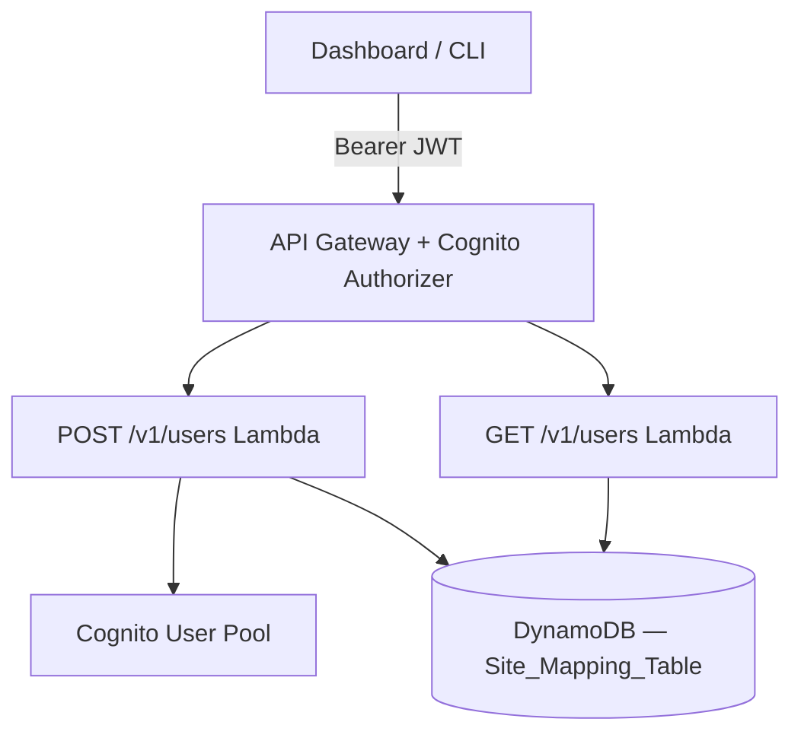

# Design Document: List Users Endpoint

## Overview

This design adds a GET /v1/users Lambda handler (`users_get.py`) and modifies the existing POST /v1/users handler (`users_post.py`) to persist a User_Record to DynamoDB at creation time. The GET handler queries all user records for a tenant using the single-table key pattern PK=`TENANT#<tenant_id>` and SK begins_with `USER#`, returning them in a single unpaginated response.

Both handlers follow the established patterns: aws-lambda-powertools for logging/metrics, the canonical `ApiError` hierarchy for error responses, correlation ID propagation, and the shared `sitespy.http`, `sitespy.errors`, and `sitespy.data` modules.

| Endpoint | Handler | Role Required |
|----------|---------|---------------|
| POST /v1/users | `sitespy.handlers.users_post.handler` | tenant_admin or super_admin |
| GET /v1/users | `sitespy.handlers.users_get.handler` | tenant_admin or super_admin |

## Architecture



**POST /v1/users flow (modified):**
1. Validate request, create Cognito user, assign group (existing logic)
2. **NEW:** Write User_Record to DynamoDB with PK=`TENANT#<tenant_id>`, SK=`USER#<sub>`
3. Return 201 with user record

**GET /v1/users flow (new):**
1. Extract JWT claims, resolve caller role
2. Enforce `tenant_admin` or `super_admin`
3. Resolve `tenant_id` (from JWT for tenant_admin, from query param for super_admin)
4. Query DynamoDB: PK=`TENANT#<tenant_id>`, SK begins_with `USER#`
5. Map DynamoDB items to response objects
6. Return 200 with `users` array

## Components and Interfaces

### Modified: POST /v1/users Handler (`users_post.py`)

After the existing Cognito user creation and group assignment logic succeeds, the handler writes a User_Record to DynamoDB:

```python
# --- NEW: Write User_Record to DynamoDB ---
try:
    data.put_user(
        tenant_id=target_tenant_id,
        sub=user_sub,
        email=email,
        full_name=full_name,
        role=target_role,
        site_access=site_access if target_role == "user" else [],
    )
except Exception as exc:
    logger.exception(
        "dynamodb_put_user_failed",
        extra={"sub": user_sub, "tenant_id": target_tenant_id},
    )
    raise InternalError() from exc
```

The DynamoDB write occurs **after** Cognito user creation and group assignment succeed. If the DynamoDB write fails, the handler returns 500 (the Cognito user exists but is not queryable via the list endpoint — an acceptable partial-failure mode logged for manual remediation).

### New: GET /v1/users Handler (`users_get.py`)

Follows the same structural pattern as `cameras_get.py`:

```python
"""Users GET handler for SiteSpy — GET /v1/users.

Lists all users for a tenant. Tenant admin or super admin.
"""

from __future__ import annotations

import re
import time
import uuid
from typing import Any

from aws_lambda_powertools import Logger, Metrics
from aws_lambda_powertools.metrics import MetricUnit

from sitespy import data
from sitespy.errors import ApiError, BadRequest, Forbidden, InternalError
from sitespy.http import error_response, json_response, unhandled_error_response

logger = Logger(service="sitespy")
metrics = Metrics(namespace="SiteSpy", service="sitespy")

_CORRELATION_ID_RE = re.compile(r"^[A-Za-z0-9_-]{1,128}$")
_ROUTE = "GET /v1/users"

_GROUP_SUPER_ADMINS = "SuperAdmins"
_GROUP_TENANT_ADMINS = "TenantAdmins"


@logger.inject_lambda_context(log_event=False)
@metrics.log_metrics(capture_cold_start_metric=True)
def handler(event: dict[str, Any], _context: Any) -> dict[str, Any]:
    """Lambda entry point for GET /v1/users."""
    start_ms = time.monotonic() * 1000
    correlation_id = _resolve_correlation_id(event)

    try:
        result = _handle(event, correlation_id)
        latency_ms = int(time.monotonic() * 1000 - start_ms)

        metrics.add_metric(name="GetUsersSuccess", unit=MetricUnit.Count, value=1)
        logger.info(
            "get_users_success",
            extra={
                "correlation_id": correlation_id,
                "route": _ROUTE,
                "status_code": result["statusCode"],
                "latency_ms": latency_ms,
            },
        )
        return result

    except ApiError as exc:
        latency_ms = int(time.monotonic() * 1000 - start_ms)

        metrics.add_dimension(name="status_code", value=str(exc.status_code))
        metrics.add_metric(name="GetUsersFailure", unit=MetricUnit.Count, value=1)

        logger.warning(
            "get_users_failure",
            extra={
                "correlation_id": correlation_id,
                "route": _ROUTE,
                "status_code": exc.status_code,
                "latency_ms": latency_ms,
                "error": exc.error_key,
                "failure_reason": type(exc).__name__.lower(),
            },
        )
        return error_response(exc, correlation_id)

    except Exception:
        latency_ms = int(time.monotonic() * 1000 - start_ms)

        metrics.add_dimension(name="status_code", value="500")
        metrics.add_metric(name="GetUsersFailure", unit=MetricUnit.Count, value=1)

        logger.exception(
            "get_users_unhandled_error",
            extra={
                "correlation_id": correlation_id,
                "route": _ROUTE,
                "status_code": 500,
                "latency_ms": latency_ms,
                "error": "INTERNAL_ERROR",
                "failure_reason": "unhandled_exception",
            },
        )
        return unhandled_error_response(correlation_id)


def _handle(event: dict[str, Any], correlation_id: str) -> dict[str, Any]:
    """Core logic for GET /v1/users."""
    claims = _extract_claims(event)
    role = _resolve_role(claims)

    if role not in ("tenant_admin", "super_admin"):
        raise Forbidden()

    # Resolve tenant_id based on role
    if role == "tenant_admin":
        tenant_id = (claims.get("custom:tenant_id") or "").strip()
        if not tenant_id:
            raise Forbidden("Unable to resolve tenant from JWT claims.")
    else:
        query_params = event.get("queryStringParameters") or {}
        tenant_id = (query_params.get("tenant_id") or "").strip()
        if not tenant_id:
            raise BadRequest("Missing required query parameter: tenant_id.")

    # Query all user records for the tenant
    try:
        user_items = data.get_users_for_tenant(tenant_id)
    except Exception as exc:
        logger.exception("dynamodb_get_users_failed")
        raise InternalError() from exc

    # Map DynamoDB items to response objects
    users = [_map_user_item(item) for item in user_items]

    return json_response(200, {"users": users}, correlation_id)
```

### New Data Layer Functions (`sitespy/data.py`)

```python
def build_user_sk(sub: str) -> str:
    """Build the DynamoDB sort key for a user item."""
    return f"USER#{sub}"


def put_user(
    tenant_id: str,
    sub: str,
    email: str,
    full_name: str,
    role: str,
    site_access: list[str],
) -> None:
    """Write a User_Record to DynamoDB.

    PK: TENANT#<tenant_id>
    SK: USER#<sub>

    No ConditionExpression — the sub is unique from Cognito, and
    re-writes are acceptable (idempotent).
    """
    item: dict[str, Any] = {
        "PK": {"S": build_tenant_pk(tenant_id)},
        "SK": {"S": build_user_sk(sub)},
        "sub": {"S": sub},
        "email": {"S": email},
        "full_name": {"S": full_name},
        "tenant_id": {"S": tenant_id},
        "role": {"S": role},
        "site_access": {"L": [{"S": sid} for sid in site_access]},
    }

    _dynamodb_client().put_item(
        TableName=get_settings().data_table,
        Item=item,
    )


def get_users_for_tenant(tenant_id: str) -> list[Mapping[str, Any]]:
    """Fetch all User_Records for a tenant.

    Queries PK=TENANT#<tenant_id> with SK begins_with USER#.
    Returns all matching items (no pagination).
    """
    items: list[Mapping[str, Any]] = []
    kwargs: dict[str, Any] = {
        "TableName": get_settings().data_table,
        "KeyConditionExpression": "PK = :pk AND begins_with(SK, :sk_prefix)",
        "ExpressionAttributeValues": {
            ":pk": {"S": build_tenant_pk(tenant_id)},
            ":sk_prefix": {"S": "USER#"},
        },
    }

    while True:
        response = _dynamodb_client().query(**kwargs)
        items.extend(response.get("Items", []))
        last_key = response.get("LastEvaluatedKey")
        if not last_key:
            break
        kwargs["ExclusiveStartKey"] = last_key

    return items
```

### Item Mapping Helper (in `users_get.py`)

```python
def _map_user_item(item: dict[str, Any]) -> dict[str, Any]:
    """Map a raw DynamoDB User_Record item to the API response shape."""
    site_access_attr = item.get("site_access", {})
    if "L" in site_access_attr:
        site_access = [entry.get("S", "") for entry in site_access_attr["L"]]
    else:
        site_access = []

    return {
        "sub": item.get("sub", {}).get("S", ""),
        "email": item.get("email", {}).get("S", ""),
        "full_name": item.get("full_name", {}).get("S", ""),
        "tenant_id": item.get("tenant_id", {}).get("S", ""),
        "role": item.get("role", {}).get("S", ""),
        "site_access": site_access,
    }
```

### Auth Helpers (inline, matching existing pattern)

```python
def _extract_claims(event: dict[str, Any]) -> dict[str, Any]:
    """Extract Cognito JWT claims from the API Gateway authorizer context."""
    request_context = event.get("requestContext") or {}
    authorizer = request_context.get("authorizer") or {}
    return authorizer.get("claims") or {}


def _resolve_role(claims: dict[str, Any]) -> str:
    """Resolve role from JWT claims."""
    raw_groups = claims.get("cognito:groups") or ""
    if isinstance(raw_groups, list):
        groups: list[str] = raw_groups
    else:
        groups = [g.strip() for g in str(raw_groups).split(",") if g.strip()]
        if len(groups) == 1 and " " in groups[0]:
            groups = [g.strip() for g in groups[0].split() if g.strip()]

    if _GROUP_SUPER_ADMINS in groups:
        return "super_admin"
    elif _GROUP_TENANT_ADMINS in groups:
        return "tenant_admin"
    return "user"


def _resolve_correlation_id(event: dict[str, Any]) -> str:
    """Return the X-Correlation-Id header if valid, else a fresh UUID v4."""
    headers = event.get("headers") or {}
    value = headers.get("X-Correlation-Id") or headers.get("x-correlation-id") or ""
    if _CORRELATION_ID_RE.match(value):
        return value
    return str(uuid.uuid4())
```

## Data Models

### User_Record (DynamoDB Item)

| Attribute | Type | Example |
|-----------|------|---------|
| PK | S | `TENANT#acme_corp` |
| SK | S | `USER#a1b2c3d4-e5f6-7890-abcd-ef1234567890` |
| sub | S | `a1b2c3d4-e5f6-7890-abcd-ef1234567890` |
| email | S | `jane.doe@acme.example.com` |
| full_name | S | `Jane Doe` |
| tenant_id | S | `acme_corp` |
| role | S | `user` |
| site_access | L | `[{"S": "site_001"}, {"S": "site_002"}]` |

**Key pattern:** PK=`TENANT#<tenant_id>`, SK=`USER#<sub>`

**Query pattern:** PK=`TENANT#<tenant_id>` AND SK begins_with `USER#` returns all users for a tenant.

### Request/Response Schemas

**GET /v1/users (Tenant Admin) — Request:**
```
GET /v1/users
Authorization: Bearer <jwt_with_custom:tenant_id=acme_corp>
X-Correlation-Id: req-abc-123
```

**GET /v1/users?tenant_id=acme_corp (Super Admin) — Request:**
```
GET /v1/users?tenant_id=acme_corp
Authorization: Bearer <jwt_with_SuperAdmins_group>
X-Correlation-Id: req-abc-123
```

**GET /v1/users — Response (200):**
```json
{
  "users": [
    {
      "sub": "a1b2c3d4-e5f6-7890-abcd-ef1234567890",
      "email": "jane.doe@acme.example.com",
      "full_name": "Jane Doe",
      "tenant_id": "acme_corp",
      "role": "user",
      "site_access": ["site_001", "site_002"]
    },
    {
      "sub": "b2c3d4e5-f6a7-8901-bcde-f12345678901",
      "email": "admin@acme.example.com",
      "full_name": "Admin User",
      "tenant_id": "acme_corp",
      "role": "tenant_admin",
      "site_access": []
    }
  ]
}
```

**GET /v1/users — Response (200, empty):**
```json
{
  "users": []
}
```

**Error Response (403):**
```json
{
  "error": "ACCESS_DENIED",
  "message": "You do not have access to this site."
}
```

**Error Response (400, super_admin missing tenant_id):**
```json
{
  "error": "BAD_REQUEST",
  "message": "Missing required query parameter: tenant_id."
}
```

## SAM Template Addition

```yaml
UsersGetFunction:
  Type: AWS::Serverless::Function
  Properties:
    Handler: sitespy.handlers.users_get.handler
    Runtime: python3.12
    CodeUri: src/
    MemorySize: 256
    Timeout: 10
    Environment:
      Variables:
        DATA_TABLE: !Ref SiteMappingTable
        AWS_REGION_NAME: !Ref AWS::Region
    Policies:
      - DynamoDBReadPolicy:
          TableName: !Ref SiteMappingTable
    Events:
      GetUsers:
        Type: Api
        Properties:
          Path: /v1/users
          Method: GET
          RestApiId: !Ref AdminApi
          Auth:
            Authorizer: CognitoAuthorizer
```

## Error Handling

The GET /v1/users handler follows the established error pattern:

1. **Role enforcement:** Caller without `tenant_admin` or `super_admin` → `Forbidden()` → 403 ACCESS_DENIED
2. **Missing tenant_id (super_admin):** → `BadRequest("Missing required query parameter: tenant_id.")` → 400 BAD_REQUEST
3. **DynamoDB query failure:** → `InternalError()` → 500 INTERNAL_ERROR (exception logged with full traceback)
4. **Unhandled exceptions:** Caught by outer `except Exception` block → 500 INTERNAL_ERROR (generic message, no detail leakage)

The modified POST /v1/users handler adds one error path:

5. **DynamoDB User_Record write failure:** After Cognito succeeds → `InternalError()` → 500 INTERNAL_ERROR (logged for manual remediation)

## Correctness Properties

*A property is a characteristic or behavior that should hold true across all valid executions of a system — essentially, a formal statement about what the system should do. Properties serve as the bridge between human-readable specifications and machine-verifiable correctness guarantees.*

### Property 1: Role enforcement rejects unauthorized callers

*For any* GET /v1/users request where the caller's JWT `cognito:groups` does not contain `SuperAdmins` or `TenantAdmins`, the handler SHALL return a 403 response with error key `ACCESS_DENIED` and SHALL NOT perform any DynamoDB query.

**Validates: Requirements 2.2**

### Property 2: Tenant ID resolution by role

*For any* authorized request, if the caller is a tenant_admin then the `tenant_id` used for the DynamoDB query SHALL equal the caller's JWT `custom:tenant_id` claim; if the caller is a super_admin then the `tenant_id` SHALL equal the `tenant_id` query parameter. *For any* super_admin request where the `tenant_id` query parameter is absent or empty, the handler SHALL return a 400 response with error key `BAD_REQUEST`.

**Validates: Requirements 2.3, 2.4, 2.5**

### Property 3: User record write completeness

*For any* successful POST /v1/users request, the User_Record written to DynamoDB SHALL have PK=`TENANT#<tenant_id>`, SK=`USER#<sub>`, and SHALL contain all six attributes (`sub`, `email`, `full_name`, `tenant_id`, `role`, `site_access`) with values matching the creation request and Cognito response.

**Validates: Requirements 1.1, 1.2**

### Property 4: site_access storage invariant

*For any* User_Record written to DynamoDB, if the user's role is `user` then `site_access` SHALL be stored as the list of site IDs from the creation request; if the user's role is `tenant_admin` or `super_admin` then `site_access` SHALL be stored as an empty list.

**Validates: Requirements 1.3, 1.4**

### Property 5: Query-to-response mapping preserves all fields

*For any* set of User_Record items returned by the DynamoDB query for a tenant, the GET /v1/users response SHALL contain a `users` array with exactly one element per DynamoDB item, and each element SHALL include `sub`, `email`, `full_name`, `tenant_id`, `role`, and `site_access` with values matching the stored item.

**Validates: Requirements 2.6, 2.7**

### Property 6: Correlation ID round-trip

*For any* request where the `X-Correlation-Id` header matches `^[A-Za-z0-9_-]{1,128}$`, the response SHALL echo that exact value in the `X-Correlation-Id` response header. *For any* request where the header is absent or does not match the pattern, the response SHALL contain a valid UUID v4 in the `X-Correlation-Id` response header.

**Validates: Requirements 3.1, 3.2, 3.3**

### Property 7: CORS headers present on all responses

*For any* request to GET /v1/users (success or error), the response SHALL include `Access-Control-Allow-Origin: *`, `Access-Control-Allow-Headers: Content-Type,Authorization,X-Correlation-Id`, and `Access-Control-Allow-Methods: GET,POST,PATCH,OPTIONS` headers.

**Validates: Requirements 3.7**

### Property 8: Unhandled exceptions never leak details

*For any* unhandled exception raised during GET /v1/users processing, the handler SHALL return a 500 response with error key `INTERNAL_ERROR` and a generic message that does not contain exception class names, stack traces, or internal state.

**Validates: Requirements 3.6**

## Testing Strategy

### Unit Tests (pytest)

- Happy-path: tenant_admin lists users for own tenant
- Happy-path: super_admin lists users for specified tenant
- Empty tenant returns 200 with empty `users` array
- Super_admin without `tenant_id` query param → 400
- Unauthorized role (plain `user`) → 403
- DynamoDB query failure → 500
- POST /v1/users now writes User_Record after Cognito success
- POST /v1/users DynamoDB write failure → 500 (Cognito user still exists)

### Property-Based Tests (Hypothesis)

**Library**: Hypothesis (already in use — `.hypothesis/` directory present)

**Configuration**: `@settings(max_examples=100)` minimum per property test.

| Property | Test Focus | Key Generators |
|----------|-----------|----------------|
| 1 | Role enforcement | Random claims without SuperAdmins/TenantAdmins groups |
| 2 | Tenant ID resolution | Random tenant_ids in JWT claims and query params |
| 3 | User record write completeness | Random valid user payloads, mock Cognito |
| 4 | site_access storage invariant | Random roles and site_access lists |
| 5 | Query-to-response mapping | Random DynamoDB user items |
| 6 | Correlation ID round-trip | Random valid/invalid correlation ID strings |
| 7 | CORS headers | Random requests (success and error paths) |
| 8 | Unhandled exception safety | Random exception types injected |
